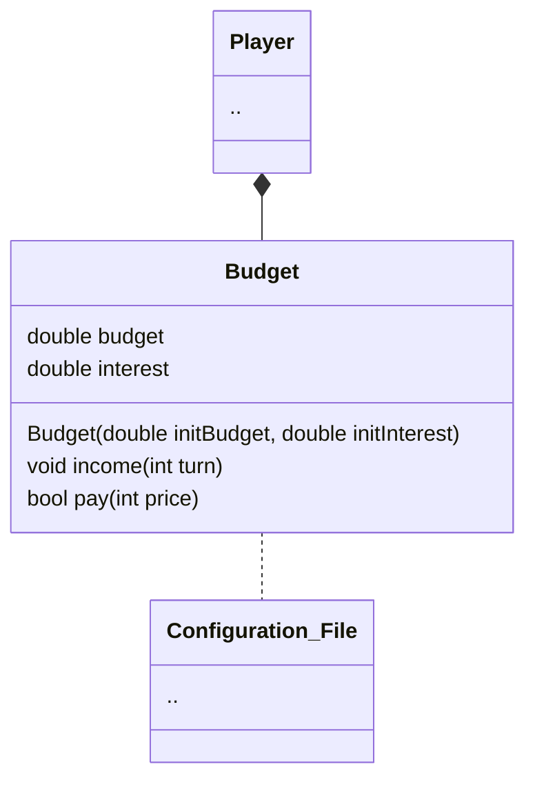

Budget is a class that handles [[player]]'s money. Many property are defines in [[Configuration File]], they are `turn_budget`, `max_budget` and `interest_pct`.

## Income Calculation
>At the beginning of each turn, the current player (including the bot) is given `turn_budget`.  Next, the overall budget(not including turn budget) accrues interest.  If the resulting budget exceeds the `max_budget`, the excess budget is forfeited

Interest is calculated following this formular
$$interest = \left\{ 
\begin{array}{ll}
0 & m < 1\\
\frac{m*r}{100} & otherwise
\end{array}
\right.$$
Where
`m = current budget` (ignoring `turn_budget` gain)
`r = interest rate percentage`
Interest Rate Percentage to be use `r` follows this formular$$r = b*log_{10}\ m *ln\ t$$Where
`b = base interest rate percentage`(`interest_pct`)
`m = current budget` (ignoring `turn_budget` gain)
`t = turn`
***
## Budget Property & Methods
Follows above procedures, budget have these properties
- budget
- interest

For `turn_budget`, `max_budget` and `interest_pct`, they can be read from [[Configuration File]].
For turn, it must be pass in as a parameter.

Methods of Budget are as follows
- Income
- pay

Income method is straight forward, the budget receive income.

For Pay methods, player needs a way to spend their money. Pay method handles the spending of that money. It checks if this pay is successful or not.

[[Player]]
[[Configuration File]]

