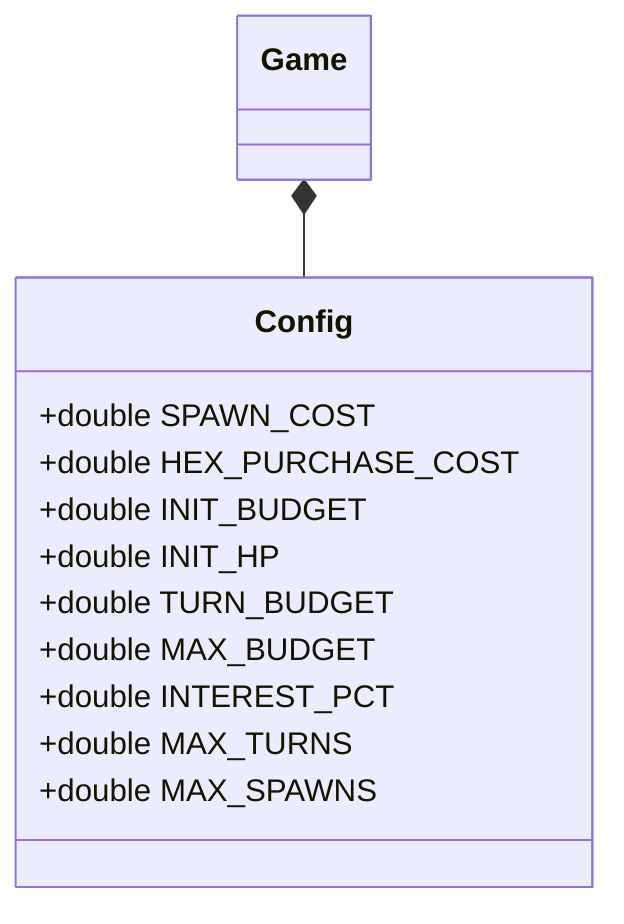

A record holding [[Configuration File]] data. Create by [[ConfigReader]] and pass into [[Game]] at Construction.

```mermaid
classDiagram
Game *-- Config
class Config{
+double SPAWN_COST
+double HEX_PURCHASE_COST
+double INIT_BUDGET 
+double INIT_HP
+double TURN_BUDGET 
+double MAX_BUDGET
+double INTEREST_PCT      
+double MAX_TURNS
+double MAX_SPAWNS
}

```
[[Configuration File]]
[[ConfigReader]]
[[Game]]