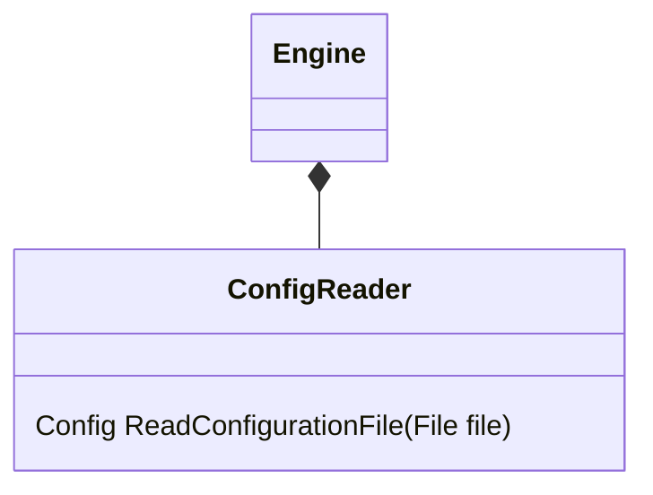

A parser for reading [[Configuration File]].
This class sole purpose is to create [[Config]] object from [[Configuration File]]. 
Can be implement easily with pattern matching.

[[Configuration File]]
[[Config]]
