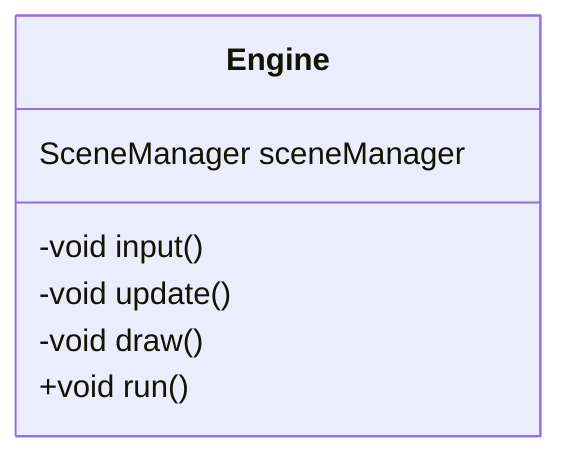

The engine class is like the main function. It sit at the top level of the hierarchy, you can says that everything here lives inside the engine.

Normally, engine's job would be to handle the window instance, controlling frame rate and such, because the engine I used to program is an engine used in Window game. But this game would be run on the web, I so I'm not very sure how it work just yet...

Anyways, the thing is there is [[SceneManager]] inside an engine and that is just about how it is. SceneManager would manage [[Scene]] or the game state for engine.

For now let look at the engine like a shell that holds everything together... The top-level manager would live here.

Engine would run in `input` and `update` loop, maybe draw for console display.. just maybe..

