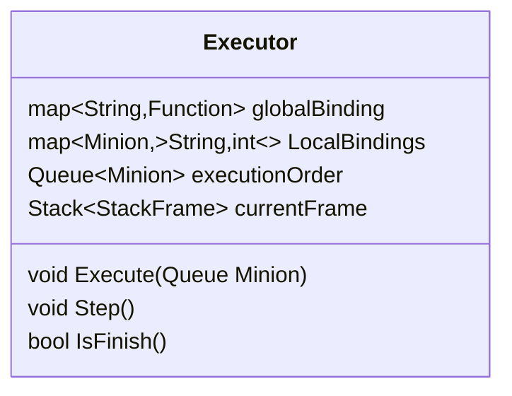

In term of complexity, this may be the most complex class.
Executor, the class for executing the strategy of minion.
What it does it
- Read [[Strategy]] object and translate them into minion's action.
- In reading the strategy, it would be able to step thru each Statement.
- It handle minion private and public variable binding instance
- It handle minion's special variables.
- It handle exceptions that may occurs when reading [[Strategy]]

Which is to say.. a lot for one class. Lets take a look at it one by one

# Stepping Through Strategy Object
What I have in mind is a function called `Step()`. It would execute the strategy until minion move or attack, or even better, a statement by statement. This presented a problem that Strategy is an **AST** when running it, it run recursively. Then how do we step thru the recursion then?

Solution, we handle the stack frame ourself. We can make an object call Stack Frame to handle the call stack. This Stack Frame would have many variants, as many as there are node types in AST. It would remember its state, evaluated itself then pass the data up the stack. For how to implement that stuff, it would not be in this documents (for now).

# Minion Variables
We know that minion can have variables, variables can have its own value. There're also private and public variables too! lets look at it ne by one
## Assignment
Assigning a variable is adding item to a **binding**. If there're already an item in the bindings, we can just change that value.

## Private Variable
We can binds the binding with that minion and store it inside the class. When that minion is gone, so is the binding is too. (Event handling behind the scene)

## Public Variable
There is also another global binding that would be handle the public variable for the minion which is stored in the Executor too.

## Special Variable
if the variable name happens to be *Special Variable* then we would need to find a way to check it. One way is created a map of that variable to the function that would be call. I'm sure Functional Programming magic can be of help here.

# Exception
any exception that may occurs would kills the instance of that strategy anyways, so there should be no problem here, I guess?

anyways, but how do we actually use this Executor then?

Executor lives inside [[Game]]. When we enter execute state, the game would get the queue from [[MinionStorage]] PQ and feed it into the Executor, then executor would be handle its job like describe above. 

Since this class is so large you can even see the light of it (like your mom), I'll leave it as is for now.

