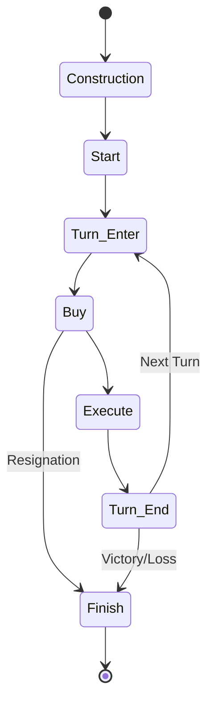
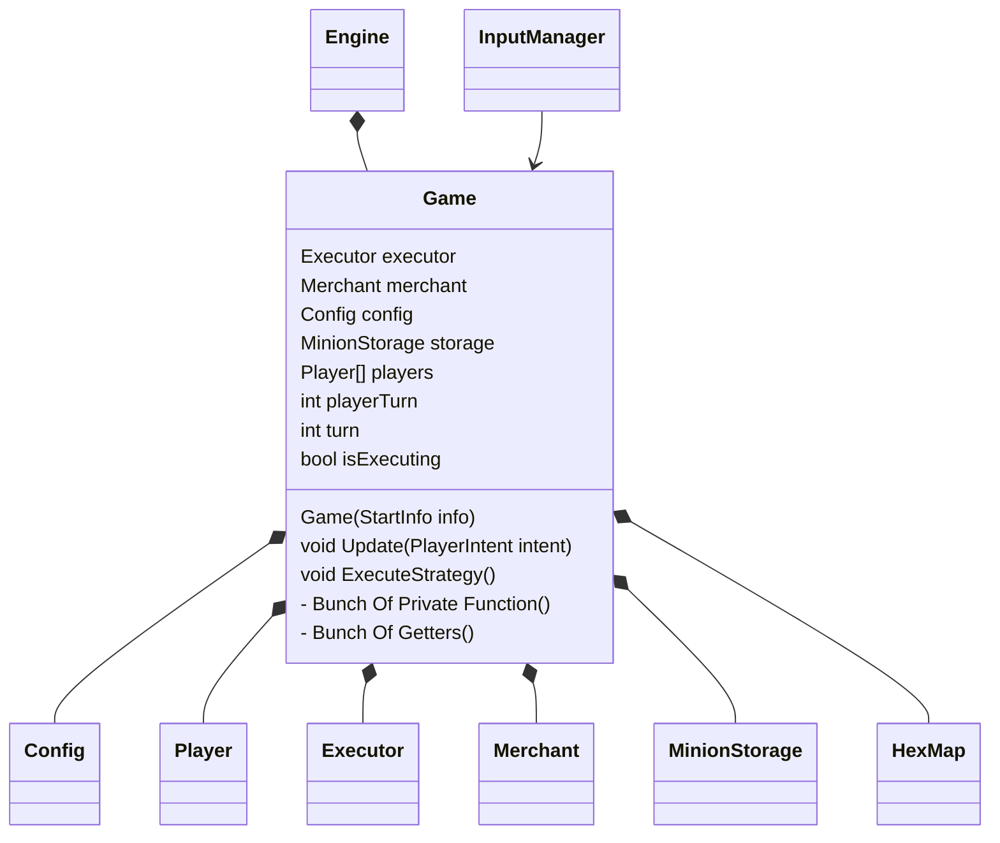

This is a big class. It run an instance of a game.

The game class is also the house for many system and service that are require in the game. But since this game is an object, it need to be feed and handle. That class would be [[Engine]].
# Instantiate The Game
By creating this object you need a [[Config]] Object, 2 [[PlayerInfo]] and 2 Deck of minion. This can be bundle into a record called [[StartInfo]].

# Game State
This game is a "turn-based strategy game". You can see each and every action player do to the game as changes in a state.  You can says that the Game itself is an object that's stateful.

But at high level, we can break the game class down into these state.
`Construction`,`Start`,`Turn Enter`,`Buy`,`Execute`,`Turn End`,`Finish`

## `Construction`
Enter form : *System*
Enter : nothing
Stay : Initialize the game
Exit Condition : true
Exit : nothing
Exit to : `Start`

On constructor call, this state initialize all property of the game such as creating [[HexMap]], assigning [[player]] etc.
## `Start`
Enter form : `Construction`
Enter : nothing
Stay : Player spawn free minion
Exit Condition : On player B summon free minion
Exit : Set turn to Player A
Exit to : `Turn_Start`

Before game start, each player get a free summon. This state handle just that.

## `Turn_Enter`
Enter form : `Start`, `Turn_End`
Enter : nothing
Stay : reset spawn count, gives income
Exit Condition : true 
Exit : nothing
Exit to : `Buy`

Reset some counters and gives income
## `Buy`
Enter form : `Turn_Enter`
Enter : nothing
Stay : Buy [[Hex]]/ [[Minion]]
Exit Condition : Player choose to exit/ Resignation 
Exit : nothing
Exit to : `Execute`, `Finish`

Can be split in to 2 sub-state
- Buy Hex - where player can buy hex
- Buy Minion - where player can buy minion

It's player choice to advance.
## `Execute`
Enter form : `Buy`
Enter : nothing
Stay : executing [[strategy]]
Exit Condition : all [[minion]] finish executing [[strategy]]
Exit : nothing
Exit to : `Turn_End`

Execute minions' strategy. Can be stepped.
## `Turn_End`
Enter form : `Execute`
Enter : nothing
Stay : change player turn & check victory
Exit Condition : true
Exit : nothing
Exit to : `Turn_Enter`, `Finish`

Check overall state of the game and decided the winner. If the game isn't finish yet, switch turn then continue to `Turn_Start`.
## `Finish`
Enter form : `Turn_End`, `Buy`
Enter : nothing
Stay : Declare winner
Exit Condition : nothing 
Exit : nothing
Exit to : nothing

Declare the winner and prepare to be deleted. 
# Receiving Input
Game advance to next state by receiving input that handled by [[InputManager]] interface in the form of [[PlayerIntent]]. (This way we can handle "botting" by replicating [[PlayerIntent]]). It would be process in the Update function.

# Updating The Game
This would be the update function's job. When the game receive [[PlayerIntent]], it goes in update function then get resolved. (I'm praying that the front end would handle this [[PlayerIntent]] stuff)

For the execution state, a flag would be set and the game would update itself (repeating executing the strategy by time, steppable) 

There maybe another auxiliary function that does not require [[PlayerIntent]]. But I'm not so sure in this state of design
# Drawing (Sending The Requested Data)
It would be as simple as adding getter and that's it. I can also bundle everything up into 1 content, that would work too, if I'm so fancy.

[[Engine]]
[[InputManager]]
[[Executor]]
[[Merchant]]
[[Configuration File]]
[[Config]]
[[MinionStorage]]
[[Player]]
[[HexMap]]
[[PlayerIntent]]
[[StartInfo]]

