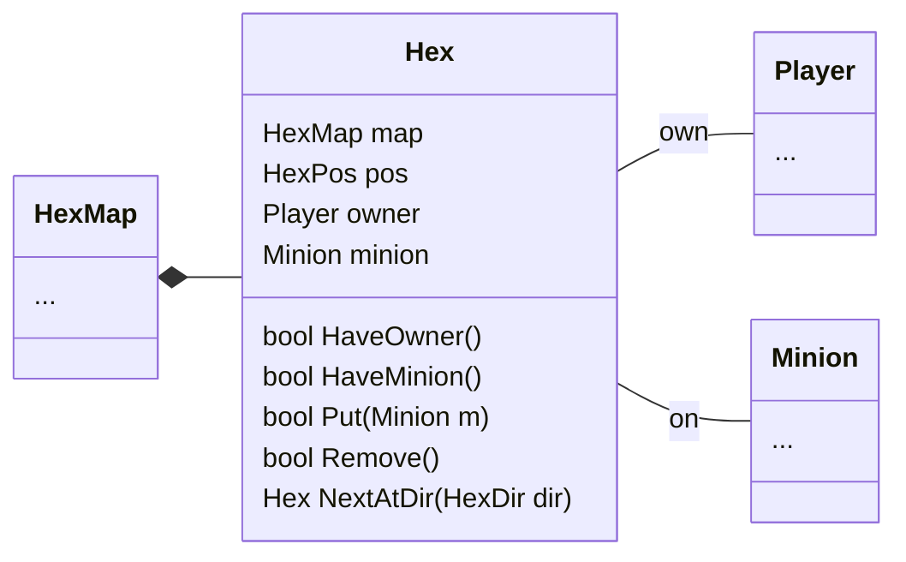

A cell in [[HexMap]]. It exist to store [[Minion]]. Hex also need to know which [[player]] is the owner.

```mermaid
classDiagram 
direction LR
HexMap *-- Hex
Hex -- Player : own
Hex -- Minion : on
HexMap : ...
Player : ...
Minion : ...
Hex : HexMap map
Hex : HexPos pos
Hex : Player owner
Hex : Minion minion 
Hex : bool HaveOwner()
Hex : bool HaveMinion()
Hex : bool Put(Minion m)
Hex : bool Remove()
Hex : Hex NextAtDir(HexDir dir) 

```
[[HexMap]]
[[Player]]
[[Minion]]
[[HexPos]]
[[HexDir]]

