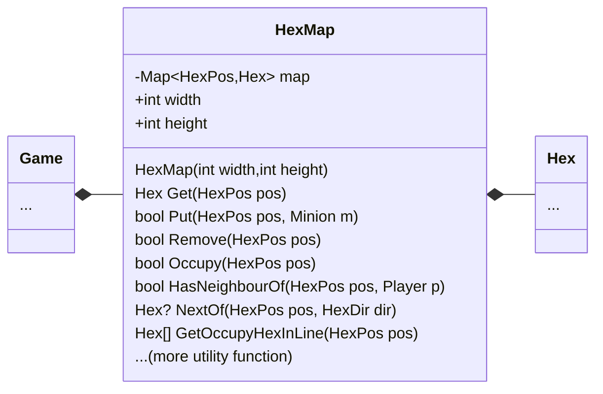

HexMap is a container of [[Hex]]. A container will not be concern of what is happening inside or outside. HexMap just exist for others to use it.

HexMap itself is not hard to imagine how it would work. But actually building it hard, you need to build a mathematical model of this HexMap first.
## What It Does
- Store [[hex]]
- Provide access to a hex at coords.
- Utility function such as finding neighbor, searching, etc.

![[Pasted image 20260120235917.png]]
[[Hex]]
[[HexPos]]
[[HexDir]]