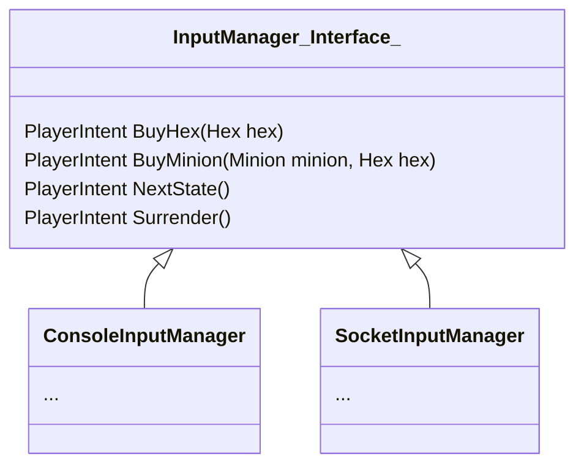

An interface for communication between User and [[Game]].

This would be an interface, since there may be many version of it.
You have to think about botting too, u know?

InputManager, to put it simply, manage input. InputManager would open a few interface for user to call, then translate those call into [[PlayerIntent]] then feed it to the [[Game]].

Bot would try to replicate those calls by reading the data from the [[Game]] and make a decision on what and how to call InputManager.

For this moment, player doesn't have many options to choose so it will be like this.
What player can do..
- Buy Hex
- Buy Minion
- Next State
- Surrender

And this is the interface

