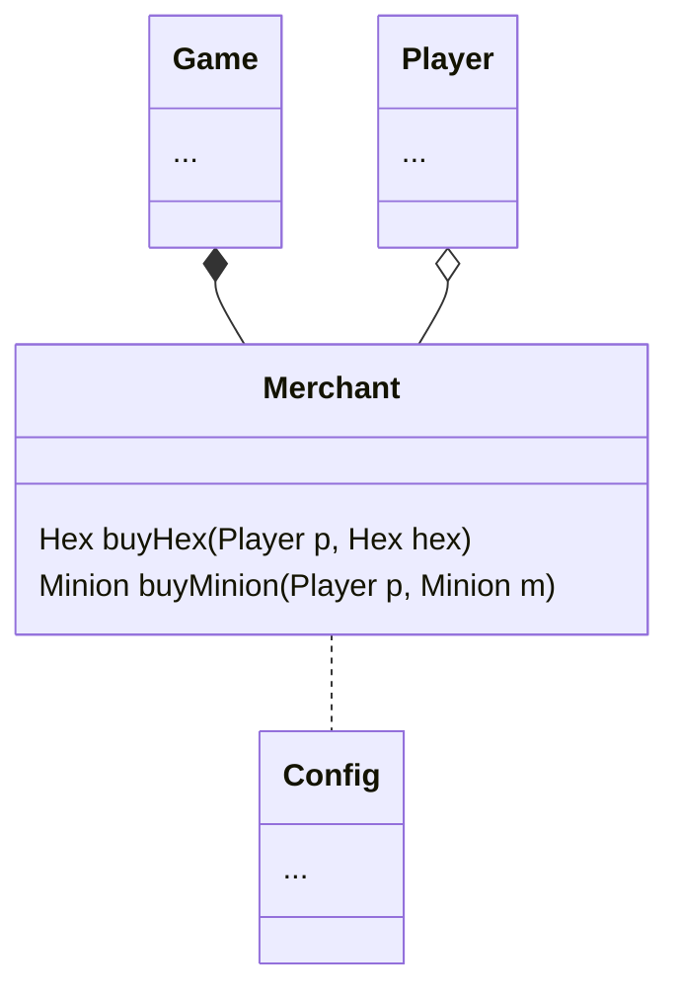

This is a "Service" class. Service operates on the act on that data without owning it. Means this merchant class does not know who it need to operates on, they need to be pass in.

Merchant's work is to handle the process of buying. There're 2 type of things that the player can buy in this game, they're [[Hex]] and [[Minion]].

Merchant sit in game class while can be reference by player. Player needs to preform the action anyways.

To buy things, that things need to be passed into the merchant together with a [[player]] who is buying. Then the budget would be deduct from that player's [[Budget]]. Then if the payment is success, return that item to the buyer. 

Merchant reads costs from [[Configuration File]]

The Merchant is responsible solely for processing purchases.

[[Game]]
[[Player]]
[[Merchant]]
[[Minion]]
[[Hex]]
[[Configuration File]]
[[Budget]]