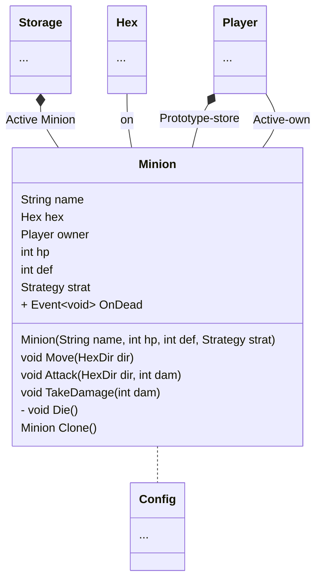

A character on a playing field, controlled by [[Strategy]]. Minion can preform few action including `Move`, `Attack`. It can also `Take Damage` and `Die`. When minion die, a event will be trigger, removing that minion from every collections.

> [!tip] Reason Why Event Was Mentioned Here
> [[Incremental Design Page#Player On New Turn]]

Minion can be classified into 2 categories. Active Minion and Deck Minion(also called *Prototype Minion*).

Deck Minion is a minion that is a prototype, not exist inside the [[HexMap]] but inside [[Player]]. [[Player]] can choose to summon a minion in their deck. That deck minion then get cloned and be put in a field as Active Minion. 

Active Minion is a minion that is on the [[HexMap]], currently occupying a [[Hex]].
This one is being properly stored inside [Storage class](MinionStorage.md)

Some property of minion are define at [[Configuration File]] such as initial `hp`.
Others are given before the game such as `name`, `def` and `strategy`.

[[MinionStorage]]
[[Hex]]
[[HexMap]]
[[Strategy]]
[[Player]]
[[HexDir]]
[Event](https://en.wikipedia.org/wiki/Observer_pattern)
[[Configuration File]]