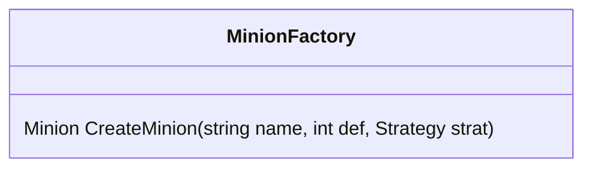

Minion Factory is a factory object. It creates [minions](minion) and bind a [[strategy]] to that minion.

In the game, when agreeing on [[minion]] kinds, alongside a [[strategy]], player need to assign name and def factor to a [[minion]] too.

The class lives inside Engine, waiting to be call at the minion selection state. When player finish assigning the minion name, strategy and def. That minion would be created and put on wait in the [[Deck]] until the game start.

[[Minion]]
[[Strategy]]