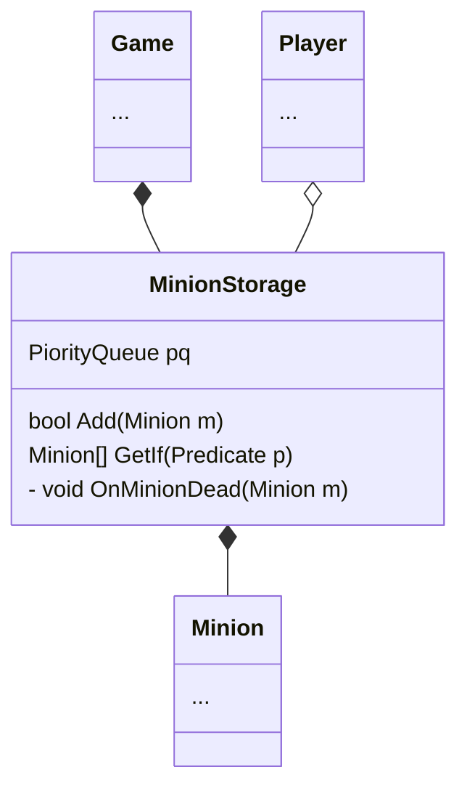

Not to confuse with [[StrategyStorage]].
MinionStorage stores active [[minion]] - minion that're currently on playing field, the [[HexMap]].

Active Minion are stored in the PQ ordered by time. Both [[player]]'s minion will be store in the same PQ. There will be function to get from the storage and the function to remove them. There also need to be a function to `GetIf` for only selecting one player's minions to feed into executor.

There'll be a listener for when a minion is dead

[[Game]]
[[Player]]
[[Minion]]
[[HexMap]]
[[StrategyStorage]]
