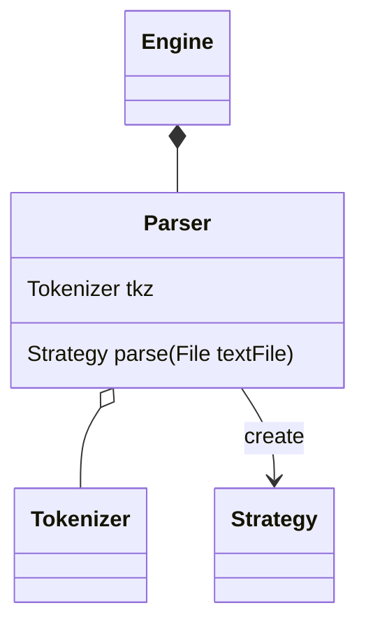

This class would parse the file following [[Minion Gramma]] into [[Strategy]] object.
You can implement this class following the Gramma and nothing bad should happens.

Parser would live in Select Scene where you can import files.

By implementing the parser, you would need to implement the [[Tokenizer]] too.

