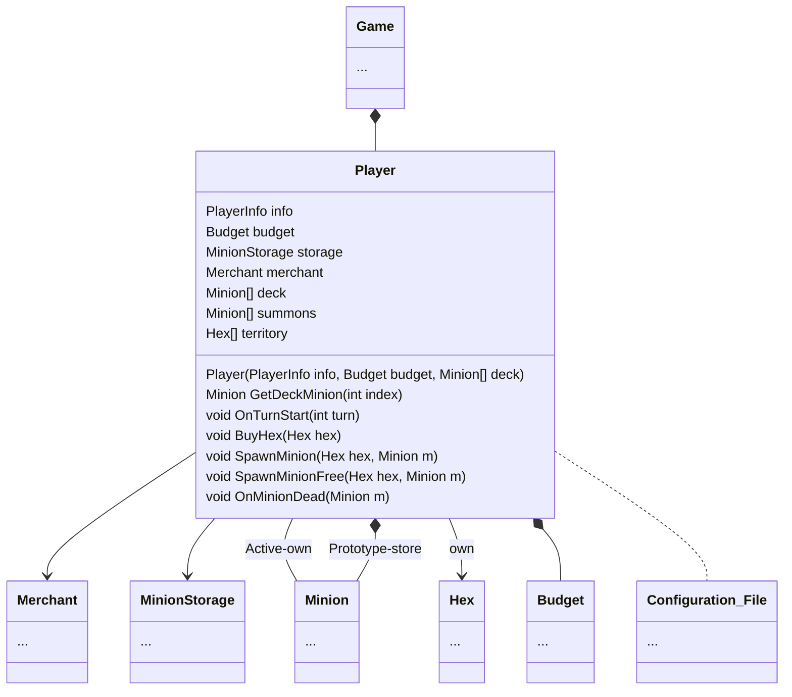

The game player by 2 player. I'll refer to them as A and B. A comes before B.

Player is a class representation of a "player". It contains information only known to that player and some action that the player can do.
The information are
- [[Budget]]
- Deck Minions
- [Hexes](Hex)
- [Active Minions](Minion)
and some others to keep track of player's state

Player also hold some basic information, like name or something alike. That will be bundle up in [[PlayerInfo]].

And the action are
- Buying [[Hex]]
- Spawning [[Minion]]

>[!warning] There's a problem with having deck live inside the player.
![[Incremental Design Page#Problem with having Player own a Deck]]

On start game, player will be given initial [[budget]] and get 1 free summon. I'd say make a special function for this is fine.

On Turn Start, player will get income calculated by the turn number then they can choose to buy [hexes](hex) and [minions](minion) which is limited the count in [[Configuration File]]. That is `max_spawns`.

The player can also choose to resign and end turn but It is not player job. The [[Game]] will handle this.

When player buy stuff, this process would be handle by a service called [[Merchant]]. Then the process of putting thing to the right place would be player's job.

[[Game]]
[[Merchant]]
[[Minion]]
[[Hex]]
[[Budget]]
[[Configuration File]]
[[PlayerInfo]]