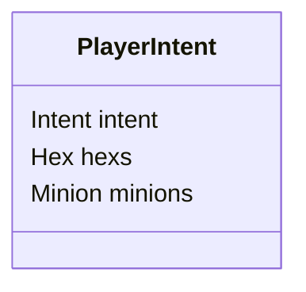

Record class created by [[InputManager]] interface containing data of what the player want to do. Object itself will be resolved by the [[Game]].

```mermaid
classDiagram
class PlayerIntent{
	Intent intent
	Hex hexs
	Minion minions
}
```