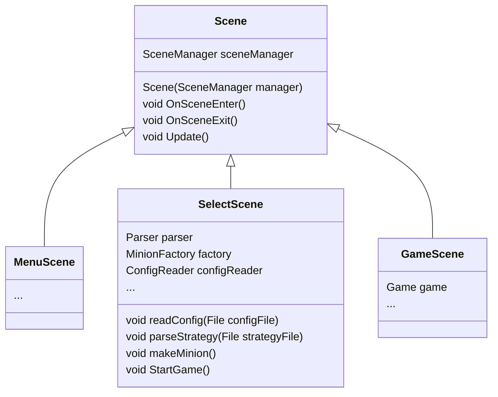

A game state. A Scene hold information about that game state.
For Example, in **Select Scene** we can import a file to be parsed as [[Strategy]], so there will be a [[parser]] living inside Select Scene.

A scene may have it own InputManager. Right now the sole [[InputManager]] is being use as an interfaces between front-end and back-end for the [[Game]] object.

Scene may handle the event such as button clicking - scene change and such.

Since Scene is a state, there will be `OnSceneEnter()` and `OnSceneExit()` function on enter and exit.

Well well well... But how do we get the data we need to render at the front end?
We might need to have an object to act as an interface for data transmission but that's the story for another day...

Note that this would not be the final implementation of the Scene object since it is so large I cant see the end of it (like your mom).
