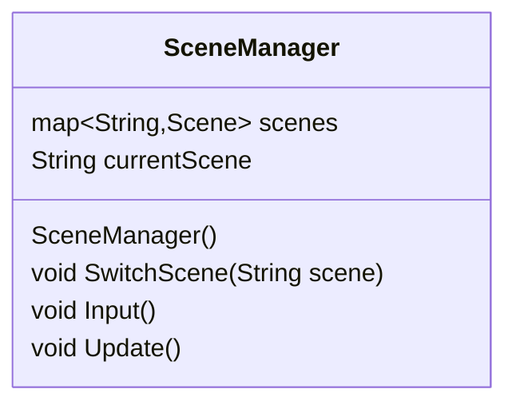

SceneManager is to manage scene, it does stuff like getting input to [[Scene]]'s Input manager and update the scene itself.

Right now we know 3 important scene that need to be implement, this includes
- Menu Scene - Main menu, where you can choose how to play the game.
- Select Scene - A Scene where you can choose the minions. This scene would contains a window to import a file to be parse as strategy and be store. You can create minion in this scene.
- Game Scene - Where the game's instance lives. This scene have its own customize [[InputManager]] to translate player input into [[PlayerIntent]] to feed it to the [[Game]].

The SceneManager Job would be choosing which scene to run and open an interface for changing scene.

