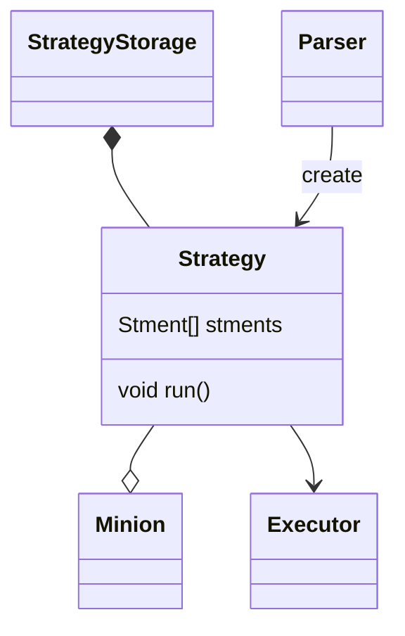
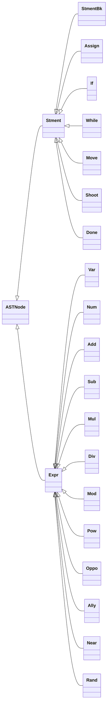

Strategy is the brain of the [[minion]]. It allow minion to act, which follow [[Minion Gramma]].
Strategy begins it life at the [[Parser]]. The parser would parse the file into Strategy object the stored in [[StrategyStorage]].
Strategy would be binds to minion then act as that minion controller.
Actually the one who read the strategy is [[Executor]] class. So the strategy would need to be design differently from the lectures.

First lets talk what would the [[executor]] do to the strategy.

- Since the strategy is recursive, we can't just run a function like in the lecture (`Eval(Map<U,V> binds)`). We need to implement our own stack.
- Each node store a pointer to another node of a kinds
- When run, we can store each node as a stack frame inside the implemented stack
- The value would be inject upward the stack frame
- This process repeat until we read all of the strategy.

As you can see, there are a lot we cannot see at the moment. So lets look at how strategy would be implement.

Strategy have at least 1 Statement, we'll call it [[Stment]].
This would be store inside a list.
The executor then would iterate thru the list and execute each [[Stment]]

Diagram below would show how Strategy would be implement as a class

This one would be inhertance heirachy of the Strategy

[[Strategy AST Incremental Design]]
[[StrategyStorage]]
[[Minion Gramma]]
[[Minion]]
[[Executor]]