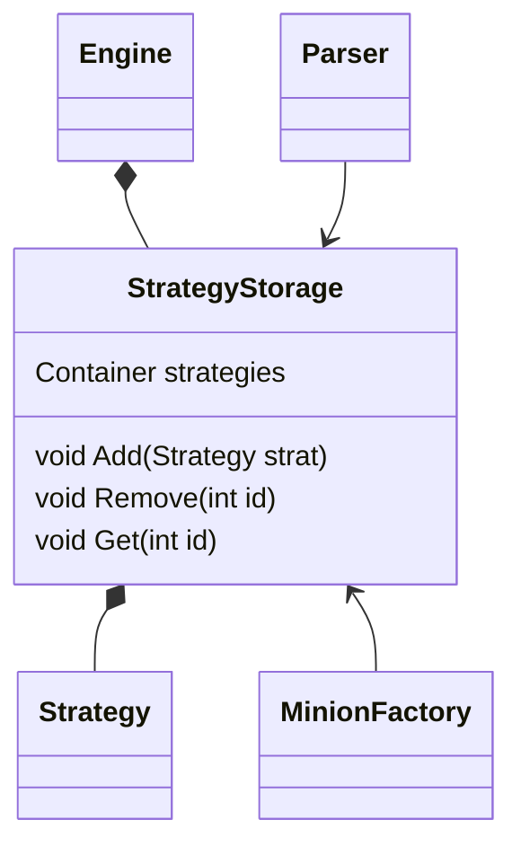

Not to confuse with [[StrategyStorage]].
This class lives inside [[Engine]]. It store minion [[Strategy]].

After the [[Parser]] successfully parsed [[Minion gramma]] creating [[Strategy]] object, that object will be stored here. 

It would then be binds to a [[Minion]] by [[MinionFactory]]. Since the reference have no state (hopefully), we don't have to worries too much about aliasing. 

