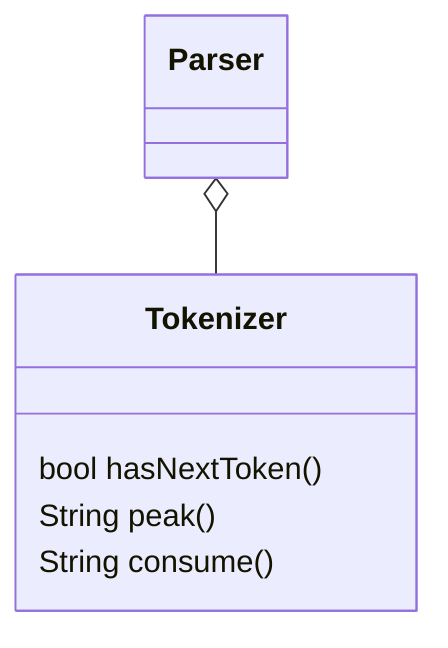

A class that would tokenize the given string stream. It exist inside parser.

implementation will follows in-class LL1Tokenizer.

```mermaid
classDiagram
class Tokenizer{
	bool hasNextToken()
	String peak()
	String consume()
}

Parser o-- Tokenizer

```

