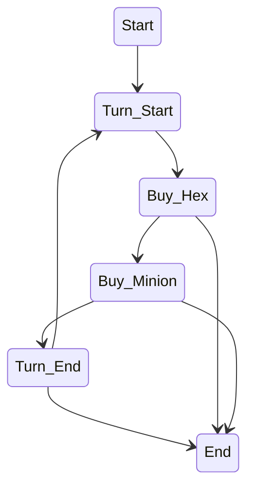
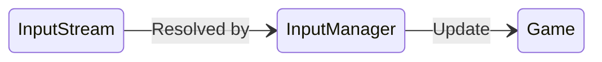
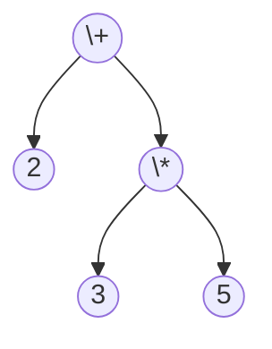

> [!abstract] Hello 
> Welcome to [KOMBAT](https://docs.google.com/document/d/1kt4jBTewppdO4j-Qg_axiLZG2Ony1P60n-WjL9Bvpco/edit?usp=sharing) incremental design document. This page serve as idea sketch so there'll be a lot of me talking to myself right here.

man I can still remember how to use **markdown** >u<
***
>[!info] Note to My Friends
This page is called "Incremental Design Page". It is for me to write whatever comes to mind. Formal design are in Classes folder
***
# The Game
Well, [KOMBAT](https://docs.google.com/document/d/1kt4jBTewppdO4j-Qg_axiLZG2Ony1P60n-WjL9Bvpco/edit?usp=sharing) is a game, a turn base strategy game that is. By grazing you may think this project is well.. very big... which is yea, it's big..
Man I'm curious how fast I typed... brb.. so it's ~50wpm, nice
So the project is not that big but because we need to integrate to many things.. and the parser too. That what make the project big.

Focusing on the game. I'll call it [[Game]] class. This thing is a [state machine](https://en.wikipedia.org/wiki/Finite-state_machine). The game can be created with a [[Configuration File]] and 2 Decks of [[minion]] for each [[Player]]s. I guess that's the minimum requirement to create a game.

This game is played in hexagonal map with coords sys like this..
![[Pasted image 20260120000720.png]]
We will call this thing [[HexMap]] and each grid is called [[Hex]]. Very piacular design to add on to the difficulty, indeed. 

> [!info] What to do when Implement
> * Find Invariant 
> * Make a mathematical model of it
> * Then code, lol

Well, you may see that a [[HexMap]] contains Hexes. A minion is places on one of those many hexes. So HexMap is acting like a container where each slot called "[[Hex]]" contains some property and minion can *occupy* it.

Then those [[minion]] executes strategy binds to it at the start of the game.. Well, each kinds of minion own its strategy. The strategy is like [[minion]]'s brain which is a code written in [[Minion Gramma]], pass thru a [[Parser]] then split out as strategy object. That means this *[[Strategy]] object* is an **AST**. That means it needs it own class to handle the brain... This will come later.

## The Game Is A State Machine
Back to the game. Well, you know what's a state machine. I know what is a state machine. 
If you break the game down it contains only a few state u know? It goes like this
- Start - Initialization process, to get the game ready for the player to play
- Turn Enter - Happens instantaneously after Turn End. In this state, playing player will get income and that's it.
- Buy State - Can be split in to 2 sub-state
	- Buy Hex - Player can choose to buy [[Hex]] (or not).
	- Buy Minion - Player can choose to buy [[minion]] (also or not).
- Strategy Execution - When player finish buying stuff, their minions executes their [[Strategy]] one by one order by time. The oldest execute first to the newest. 
- Turn End - After the minion finished their execution, the turn ends. This one also happens instantaneously. This state check the overall state of the game and determinate the winner(When one player have 0 minion on the field).  Oh and also switch the playing player turn before goes to the next turn.
>[!danger] Keep in mind that there is a self-sabotage can happens.
>So the winner isn't always the other player that's not on this turn.
- End - When the game end by once all minion of a player is wiped out or resignation. This state preparing to quit the game and delete its instance. This one can be enter from Buy state (via resignation) too, not just Turn End State.

So the diagram would be something like this..


*oh yea the diagram is dope.. wtf it even have a class diagram*

So yea, implement a state like that would be nice.. A generic state machine for this would be awesome but.. The overhead is just too large. So when implementing, just use some variable to keep track of the state, no need to write a state as an entire class.
Also, Buy Hex state and Buy Minion State can be its own state. No need for hieratical state machine here(overhead too big, same reason).
## The Game Is Also A Fucking Object
from what I wrote so far, the game is suppose to be one big object that run well.. the game. When the game start, thing initialize. When the game end, things destroyed. So the game store the state of the current event happening inside! OMG just like when I'm creating a stack in Haskell! So there must be some way to observe what is happening inside the Game, to retrieve the information (to mostly draw) and talk to the game (player action). Oh yea I'm starting to see now. 
The [[Game]] is managed by [[Engine]] Class. There will be some [dependency injection](https://en.wikipedia.org/wiki/Dependency_injection) happening when it's coming to input and draw but that's a work for another day.

It seem like we have talk a lot about the game now, let move on to another topic

yea lets takes some rest >u<
***
back!

So we know how the game would work now, lets move on to the components inside the game.
***
# [[Minion]]
Minions, a character that can be places on a [[HexMap]] and have its brain as [[Strategy]]. Beside being controlled by [[Strategy]], it can do only a few things. That is..
- Move
- Attack
- Take Damage
- Dies

Where **Move** and **Attack** are *ActionCommand* from the [Gramma](Minion Gramma). So the minion must know where it is in [[HexMap]], the coordinate it is in, that is. 

[[Player]] can spawn [[Minion]] while in "Buy State" in their turn. A minion can be spawn on a *Spawnable Hex* which player can buy on this state (they're 2 part of buy state, hex one and minion one). Any number of minion can be spawn in this state.

This implies that minion have to be store somewhere...

## Storing Minion
Well, minions have to be store somewhere, so there must be storage, right? Well, there're only one type of minion. So no inheritance is needed. But each minion is differentiated by the its [[Strategy]].

[[Strategy]] is create through a parser which then are stored somewhere. When [Minion Factory](https://en.wikipedia.org/wiki/Factory_method_pattern) create a minion, it will inject a desired strategy into that minion, then put the minion into a [PQ](https://en.wikipedia.org/wiki/Priority_queue)(Priority queue) order by time. This way we can execute their strategy in order.

Now the [[MinionStorage]]. [[MinionStorage]] seem to have to store 2 things, that is.~~
- Active Minion Instance in [PQ](https://en.wikipedia.org/wiki/Priority_queue)
- Strategy Instances

Now where should the storage lives? Of course it live inside the [[Game]]. I did say that the game req 2 things that is [[Configuration File]] and 2 decks of minion. A deck of minion is a set of [[strategy]] that player choose. 

I see something here.. If all minion is the same when created only to be assign a difference strategy, then creating a [[Game]] with only sets of [[strategy]] is fine. But if we want each minion to be difference. i.e. difference strategy make minion have difference color, hp, def. Now the game must be created with actual minion instead of strategy.

So the game must be created with minion after all..
For the sake of easiness, I'll let the storage store one more things. It's called Deck Minion. These minions won't be on the playing field, but a reference minion object to be clone. Cloning is more efficient than creating anew, right?

## Creating Minion
A minion will be created through a [Factory](https://en.wikipedia.org/wiki/Factory_method_pattern). What it does is easy, just apply Strategy to the newly create object. And there's another thing, cloning...
Well, since the player would be the one who spawn, isn't it okay to let player handle the process of cloning and put it into the storage? That would be nice.

So the process will be something like this.

- Before game even start, files are passed into the parser. The parser parsed the file as Strategy.
- That Strategy is stored in the storage. **This implies that strategy storage live outside the game.**
- player select strategy to bring (and maybe create some configuration of the minion)
- When game start, factories create a minion from those config. If none exist, then the factory just inject a strategy to a minion and call it a day.
- This newly create minion is now called **Prototype Minion** it lives inside player, waiting to be clone.
- Cloning and putting these minion into the storage is player's job. Because the player needs to spawn them so it make sense for the player to handle this thing.
- Minion handles the cloning.

## Minion Strategy Execution
So minion can move and attack.. take damage and dies.. But the last 2 thing can be handle internally. What [[Strategy]] can do is to move and attack. 

I'm thinking about allowing minion to execute a strategy one step at a time. What I mean by this is when you click play, you can see what minion does for each move and attack.
What came to my mind is to execute the strategy to the very end in the ghost board and record each action and replay those action one by one, so we can animate them.

Well, above is advance stuff. Lets start by talking how a minion can act.
Minion can do 2 things as I said, move and attack.
To move, a [[strategy]] stored as **AST** will be injected the [[minion]] that owns it via [[Executor]]. This is what I want it to be in my head. A minion own a pointer to its strategy, since minion is cheaper. When the minion have to execute its strategy, the executor will handle the execution. The caller of this execution would be the [[game]] class.
 
actually, the only thing that need to pass in is minion, because the minion own a strategy.
I have no idea how can I do a strategy step by step, because the **AST** evaluation is recursive.. 

>[!tip] Recursion Stepping (Solution by ChatGPT)
>Since timing and recursion doesn't work well, together. We must handle the stack itself. This AST is created from LL1 Gramma. The **Key** here is that it is a tree structure. And the recursively calling this evaluation is like doing depth-first traversal while storing the state. You learn this from Data Structure already so put it to use!

Now the game must be able to step too, what a hassle...
Oh yea and stepping from one state to another isn't even game's job, it's the engine who run the game.

Well, now we know how can we evaluated this thing. (I'm abstracting those about local variable, global variable, looping, iffing, seeing, keywords, declaration and randomness. These thing will be handle inside this [[Executor]] class.) We can move on how the strategy actually handle action.

The strategy would of course, call that function, duh- so the node in this **AST** must know a lot of things, well damn. I'll think about this later. It is not the right time.
>[!warning] Unfinish Train Of Thought
> Since this **AST** can do so much. I'm not sure how to handle it. To let the node class be very heavy with all the injection happening behind the scene? To let those class become [Singleton](https://en.wikipedia.org/wiki/Singleton_pattern)? Or to push the responsibility to another class entirely (current candidate: [[Executor]])?

***
# [[Player]]
Well there exist 2 player in a game. I'll call them A and B. A will play first.
Player in this game is abstract. There aren't any player character in the playing field, rather an object that act as an interface for the player to act and store a data only own by that player. 
These data are
- Deck of Minion
- [[Budget]]
- Owned [[hex]]
- Owned [[Minion]]

## What can player do?
To be fair player cannot do much. Player can select a hex and buy it or can summon a minion on a owned hex.
That literally 2 actions that player can do bruh..

- ### Buying Hex
To buy a hex, that hex must not have owner. Player can buy that hex only if the hex is adjacent to player owned hex. Well, the logic is there.
>[!tip]  *"That Hex Mustn't Have Owner"*
>So basically, an ownerless hex. that mean you cannot buy other player hexes.

- ### Spawning Minion
A minion can be spawn on player owned hex at a cost. Player must first select a minion to buy (i don't feel like doing a pop-up context menu, I don't feel like it is sufficient. Also, the UI ain't design by me)
## Player On New Turn
Player will gain income and some state must be reset upon player new turn. The budge is calculated via turn's number too so that thing must be pass in. The game handle turn number so that's all good.
***
welp I feel like I see something here...

> [!danger] Problem With Destroying Minion
> My initial thought is that if a player store reference of owned minion from the storage, when storage destroy that minion in some way the reference from player would be invalid and thus can be remove... But that's not the case. 
> The aliasing problem occurs here. Since Java doesn't allow destroying the object directly, even when you remove the object from storage, it instance still exist.
 
>[!done] Solution To Above Problem
>Minion will be destroy when it dies (hp < 0). By this observation, I think by putting a [listener](https://en.wikipedia.org/wiki/Observer_pattern) in a place that store these minion (in java, there're all pointers) and listen when the minion dies (minion will fire an event), the containers will all be removing that minion. Make it referenceless.
>

It's good that the hex can be there just fine xd. (no hex deletion)
***
## Player Resignation
I *almost* forget that the player can resign the game.
This action will not be handle by player, but by the game.
On resignation called, a player who call it regardless of turn will immediately lose. You can actually call this only on Buy State anyways.
[[#The Game Is A State Machine]]

---

# [[HexMap]]
[[HexMap]] (or *"HexGrid"* when I first call it) is a container of the [Hexes](Hex.md). Hex map of course, store hexes. It also handle many utility function such as 
- what does the ```UpLeft``` from this coords is?
- looking through all of the hexes in a straight line direction  ![[Pasted image 20260120235917.png]]Something like this... And gives the hexes that have the minion.
- Or check the adjacent hexes does it contain a hex of player _?

This what hex would do.
It also provide an access to the hex by \[row, col\] coordinate system.

[[HexMap]] doesn't care what happens to the game.
[[HexMap]] must be able to create a map of any size upon construction.
[[HexMap]] can't be resize when it first created.
[[HexMap]] doesn't care about the minion inside hexes.

So yea, this is basically all the HexMap for you.
***
# [[Hex]]
Now we talk about another component, the [[Hex]].
As you know, HexMap contains, of course, hexes. These Hexes are like a slot for a minion to stand on. Hex itself should know what minion is occupying it.
So, this is the information that 1 hex should know.
- Coordinate as in \[row, col\]
- Owner (what player own this hex?)
- Minion

About what hex does, it just sit there... as a slot inside HexMap.
It doesn't do anything but you can check it property.
So yea, this is a hex.
***
# [[Budget]]
Game suggest that Team(now called "Player") class should own a budget class. This class would handle the calculation of the money such as start turn income and expense on buying hex, minion, and minion expenses via [[strategy]]. 

This class lives in Player but many other class need to know it. Easy, since classes that handle the expenses are all "Service" so we need to pass player in anyways (they're [[Merchant]] and [[Executor]])

In [[Executor]] case, Enemy already know Player so we can access player from there.

About what Budget can do, here's what it can.
- Income at the start of the turn (by a formular)
- try to spend x amount of money

***
# [[Merchant]]
This class is a "Service" so it doesn't really know the outside world. When calling this class, you need to pass "who" that call this class in too.

What this class do? Well, It handle the process of buying something. If you want to buy hex, you buy it from the merchant. If you want to buy minion, you also buy it from merchant. But you need to pass the hex, the minion, who is buying in. The merchant will handle the rest.
..But only the process of buying
>[!tip] Merchant's Job
>Merchant only handle the process of buying. It will not handle putting the goods into the container for you. That not Merchant's Job.

***
# [[Executor]]
This is another service. It execute the [[Strategy]] of a minion.
To put it simply, this one is hard... maybe the hardest thing to design.

Do you remember that if we want to see minion move with each action it takes, we need to turn the recursion into something that is iteratable. This is a called for writing your own stack frame.
no worries, I have learn data structure and \*Obviously\* not using AI. (I did)

I'll be grazing of how I want it to work, the real details needs it own pages.

So the executor is a service. It's job is to execute minion strategy. The execution can be stepped and it would also make minion do what the strategy says. There's also a concept of local variable and global variable of which this executor would all handle it by itself. So yea, this class is the fucking heart of the game. I'd say that the parser is easier because you just coded them like what the gramma says.

Here's the list of thing it needed to do.
- Preform Minion Action
- Store Minion's Local (Minion variable) & Global variables (Player variable).
- Get information from [[HexMap]]

Yup, this thing is big.
> [!warning] Design Requirement
> Since it's so big, what all the stack frame and stuff. This executor cannot be design before each and every AST's node design is completed

But we get to know what this class would do, right?
yea.. that much is expected.

***
Then there will be a parser design but today, lets leave it at this. I'm kinda tired now.
***
So the times has come, It's time to design the parser part. But let me says, this..
All the infos are scattering over here, which is a no-no. It's time to move this to the class folder

So see yall in the "Classes".
...
***
# Problem with having [[Player]] own a Deck
So I just notice.. If a player own a deck then how can I access it easily?
Deck minion needs to be show.. So we need to be able to get that deck. And the player is also responsible to choosing the minion.
In a function call, it won't be `Player.SpawnMinion(Hex hex, Minion m)` (<-- I'd like to go with this approach)
But `Player.SpawnSelectedMinion(Hex)`

Or you would need to get the minion from the deck inside player first.. The code should be easy enough tbh.

---
# Reading Input
Oh damn I never think about reading an input before.
To be fair, right now I'm seeing a [[game]] as one big fat state machine. The game is stateful.
Well, since it is stateful. Each valid input will change the game state. and each state of the game, the input will be handle differently too..

The model in my head is something like this



What input is needed to update the game's state? Here's what I can think about
- Buying Minion
- Buying Hex
- Advancing strategy

The problem is at Advancing strategy, you need timing and this would not go well if the game is "Stateful".
This means I need someway when the game goes "Oh hey! I'm at executing state". The Engine would step the execution for the game.
Yea that mean engine would need to talk to the game more...

So the solution is to let [[InputManager]] be an interface for user and the game. There are few action that player can do anyways and I'm seeing by abstracting those work to [[InputManager]] it actually make the design cleaner. Game will receive input thru the interface only. The input would go in as a package.. something like Context. Like.. I don't know, we should look at the interface of the game first.
# Game Class Interface
What should the engine be able to interact with the game?
First, you can talk to the game. It will be thru `Update(PlayerIntent intent)`. Where [[PlayerIntent]] is an object that created by [[InputManager]] after processing raw input. This mean [[InputManager]] would need to store some of the data inputted by player too.

Wait.. But each player will be played by difference people.. Shouldn't the input be attched to the player!? omg I just drop something hard and heavy again. Now we have to talk about botting too!

Well, but the good design is that the game receive [[PlayerIntent]] and handle according to that intent. Wouldn't the [[PlayerIntent]] is actually the interface between front-end and back-end? If so the creation of this [[PlayerIntent]] is not my job.

Moreover, if it is their job to create a package. They doesn't have to do it manually, we can just let them call the [[InputManager]] and let it do the package-building! There, problem solved

This way, [[InputManager]] becomes Interface (Finally), There're only few thing it need to do, that is sending a correct intent to the game.

Next is stepping the execution. Well, can't we just let the game handle the stepping? Like.. On the function that does strategy execution is called (actually it is on state change), a flag is trigger and the game run independently without being block by the IO? That is the design I come up with. Internal timer is fine, game class can be big, but I don't want it to be too big. (And I kinda overstep to the front, also)

Next is drawing. Eeh.. this one is quite easy, let the front ask us what it want then we send them the correct data, that is all and well.
***
# Moving To The [[Engine]]
So the [[game]] class design is mostly finish now. We're moving to the engine. (leave the parser alone, fuck)

Engine architecture I'm going for would be to separate things into [[Scene]](Or screen). [[Scene]] is like the engine state, but as a object. We can actually do the same thing in [[Game]] but that would be overkill.

By separating Engine State(not game state) into [[Scene]], we can let individual scene do it thing. Such as start scene only have to handle buttons. Minion selection scene have file upload (would later be handle as string stream), and parser. Game scene have the Game Object running in.

Following the state object design I follow, there are enter, stay and exit. Scene object would follow this design too. What happens when the scene is enter? What happens when the scene is exit? What happens during the scene?

But for the engine to handle of this, I'd say like you're just putting stuff in main function. Lets make [[SceneManager]] class to handle these [[scene]] object for you.

## [[SceneManager]]
SceneManager manages Scenes. It store them in a map and runs update on them. You can call it to change the scene, there'll be an interface for that. 

What scene Manager should really be doing is to handle scene and scene switching and that's all it should do.
## [[Scene]]
Scene is Engine's state. Each scene have its own handler. That mean the input received in each scene must be difference. 

In my older design, each scene have its own input system.
Right now the InputManager class is handling translating raw input into PlayerIntent in Game Scene. 
But with no so much going on, can every scene don't handle the input via InputManager? It's like just calling one function for this input that's not very complicated. yea, let do that.

Now we have to talk about what scene we will have. This is really obvious.
There exist 3 scene for this game. they are `Menu`,`Select` and `Game`. I'm not sure does the user journey use this exact same name or scene or not. But I hope she will.

### Menu Scene
Well, normal menu scene. Buttons to do stuff like go to the next scene and such xd.
### Select Scene
This scene happens before the game start. It's the scene where you can selected the strategy and build minion. Maybe changing the config file and stuff. Then you click play and go to the game scene

The [[parser]] lives here
### Game Scene
This scene is well.. it start the game! The [[game]] class lives here. We play the game in this scene.
***
By the way, there exist a [strategy storage](StrategyStorage), I think I can just it it lives in select scene? Better, make it stays at the highest level, the engine
***
# Parsing
Now we're talking about the a [[parser]] (finally!)

As I already mention, parser would produce a [[strategy]] according to the given file that follow the [[Minion Gramma]]. 
Parser would reject any file that contains "syntax error". 

Implement the parser should be easy enough, you just follow the gramma while programming
***
# About AST of The [[Strategy]]
I think I did mention this earlier in this documents, this one would be hard af.

From the recursion stepping solution, we know that AST is just a tree so we can use DFT to travel thru each and every node. when valuated, return the value up the stack (DFT uses stack to store state). Right now it is the time to design those tree..

Ah shit, here we go again.
To be honest, right now we don't really know how do design an AST. Why not look at some example?
**Ex. Arithmetic Abstract Syntax Tree**
You may remember this one. 2 + 3 * 5

the syntax of it is.
```ebnf
E → E + T | T
T → T * F | F
F → n | x | (E)
```

would be parsed to.


you can see that the node are all Symbol. And they does action, actually. It does action.. The keyword is that it does action.
	Our AST instead of numbers and operators, it will be our custom actions & commands. Which will be discussed later on. The grammar has been designed beautifully with no bug, so we do not have to worry about any "out-of-context" errors like dangling if else statement.
	Reducing redundant symbols can significantly improve our executing efficiency. Instead of running the whole parsed tree all at once, we can use memoization to handle these infos.

So there would be action and literals, huh...
 Tbh, we should move to a new file. I'll call it [[Strategy AST Incremental Design]]